# High-Performance E-Commerce Backend Engine

## Structured Backend Report for Requirements 1-5

**Course:** Parallel Programming
**Project:** High-Performance E-Commerce Backend Engine
**Stack:** Django, Django REST Framework, PostgreSQL, PgBouncer, Redis, Celery, Nginx, Gunicorn, Docker Compose, Locust
**Report Scope:** Requirements 1, 2, 3, 4, and 5

---

## 1. Executive Summary

This project implements a production-style e-commerce backend that handles concurrent checkout, payment processing, wallet balance updates, product reservation, background tasks, batch jobs, and load distribution.

The implemented backend is not only a simple CRUD API. It includes explicit concurrency-control demonstrations for five race-condition cases:

1. Concurrent Checkout / Overselling
2. Wallet Checkout / Double Spend
3. Double Payment Processing
4. Cancel Order While Payment Is Processing
5. Product Reservation / Over-Reservation

The system runs five Django/Gunicorn application containers behind Nginx. PostgreSQL stores persistent data, PgBouncer controls database connection pressure, Redis is used for cache and Celery brokering, Celery workers process asynchronous jobs, and Locust validates behavior under concurrent load.

| Requirement | Topic | Implemented Solution | Evidence |
|---|---|---|---|
| Requirement 1 | Race condition safety | Five concurrency cases using row locks and state checks | `race1_before` vs `race1_after` Locust modes |
| Requirement 2 | Resource management | Gunicorn gthread workers, PgBouncer pooling, bounded Celery concurrency | 5 app containers x 8 workers x 3 threads = 120 request handlers |
| Requirement 3 | Asynchronous queues | Redis + Celery with separated `emails`, `batch`, and `celery` queues | Sync email/payment waits; async path returns immediately |
| Requirement 4 | Batch processing | Daily sales aggregation in chunks on a dedicated batch worker | Naive task loads all orders; optimized task logs chunks |
| Requirement 5 | Load distribution | Nginx Least Connections across `app1`, `app2`, `app3`, `app4`, and `app5` | Nginx upstream logs show all five backends |

---

## 2. Current System Architecture

```text
Client / Browser / Locust
        |
        v
Nginx Reverse Proxy + Load Balancer
        |
        +----> app1: Django + Gunicorn
        +----> app2: Django + Gunicorn
        +----> app3: Django + Gunicorn
        +----> app4: Django + Gunicorn
        +----> app5: Django + Gunicorn
                    |
                    v
                PgBouncer
                    |
                    v
               PostgreSQL

Django / Celery Producers
        |
        v
Redis Broker + Cache
        |
        +----> celery_worker       queue=celery, concurrency=2
        +----> celery_email_worker queue=emails, concurrency=4
        +----> celery_batch_worker queue=batch,  concurrency=1
        +----> celery_beat         scheduled jobs
```

Main runtime containers used by the backend:

| Container | Purpose |
|---|---|
| `ecommerce_nginx` | Public HTTP entry point and load balancer |
| `ecommerce_app1` to `ecommerce_app5` | Django/Gunicorn API workers |
| `ecommerce_db` | PostgreSQL database |
| `ecommerce_pgbouncer` | Transaction-pooling layer in front of PostgreSQL |
| `ecommerce_redis` | Redis cache and Celery broker |
| `ecommerce_celery_worker` | General Celery queue |
| `ecommerce_celery_email_worker` | Email/background notification queue |
| `ecommerce_celery_batch_worker` | Batch-processing queue |
| `ecommerce_celery_beat` | Periodic task scheduler |

---

## 3. Requirement 1 - Race Condition Safety

### 3.1 Goal

The goal is to prove that shared e-commerce data can break under concurrent access, then show how the implemented backend prevents those failures.

The project validates five concrete race-condition cases, not only a single stock race.

| Case | Problem | Demo / Risk Endpoint | Protected Endpoint |
|---|---|---|---|
| Case 1 | Concurrent checkout can oversell stock | `POST /api/orders/race-demo/` | `POST /api/orders/checkout/` |
| Case 2 | Wallet checkout can double-spend balance | `POST /api/orders/blocking-wallet-checkout/` | `POST /api/orders/checkout-wallet-async/` |
| Case 3 | Same order can be paid twice | `POST /api/orders/<id>/process-payment-unsafe/` | `POST /api/orders/<id>/process-payment/` |
| Case 4 | Paid order can be cancelled during payment transition | `POST /api/orders/<id>/cancel-unsafe/` | `POST /api/orders/<id>/cancel/` |
| Case 5 | Product reservations can exceed available stock | `POST /api/products/<id>/reserve-unsafe/` | `POST /api/products/<id>/reserve/` |

### 3.2 Synchronization Techniques Used

| Technique | Used In | Reason |
|---|---|---|
| `transaction.atomic()` | Checkout, wallet checkout, payment, cancel, restock, reservation | Keeps related writes all-or-nothing |
| `select_for_update()` | Product rows, user wallet row, order row, payment row | Serializes critical updates on shared rows |
| Consistent lock ordering | Product rows sorted by id during checkout | Reduces deadlock risk |
| State validation | Payment and cancellation endpoints | Prevents invalid transitions such as paying a cancelled order |
| Optimistic version field | Product helper logic | Detects lower-risk inventory conflicts without holding locks |

### 3.3 Case 1: Concurrent Checkout / Overselling

**Explanation of the first case**: This issue occurs when multiple users attempt to purchase the same low-stock product simultaneously.

Before resolution, the unsafe checkout endpoint reads the stock value without locking the product record.
Possible outcome:
Inventory could become negatively valued, which proves that overselling has occurred.

this db before start test:

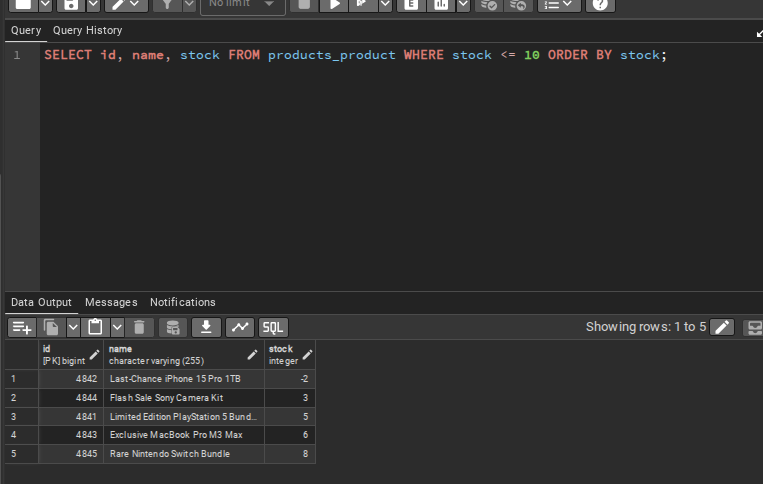

now we start test: This is a Python-based testing tool called locust that allows us to synchronize a selected number of requests.

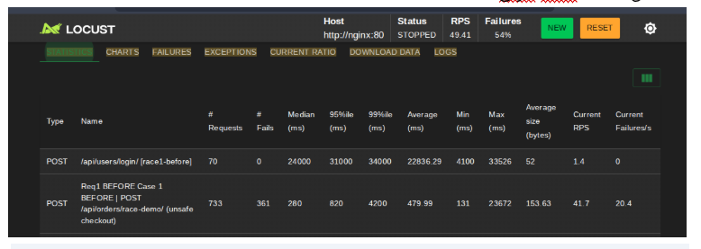


**Before:** `POST /api/orders/race-demo/`

The unsafe endpoint intentionally reads a product without locking, sleeps for 100 ms, then decrements stock using `F("stock") - 1` without enforcing a stock floor. Under concurrent users, many requests can proceed from stale stock knowledge and push stock below zero.

and this fail of endpoint


and this db after start test (We have now examined the database, checked the inventory, and confirmed that the problem does indeed exist.):


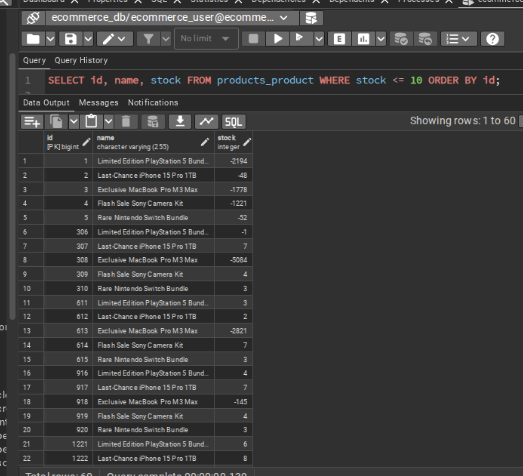


**After:** Solution
Now we will discuss how to solve this type of problem:
1. Order Creation / Preventing Overselling
Method Used:
Pessimistic Locking + transaction.atomic()

Pessimistic Locking was used because the order creation process modifies inventory, a shared resource among multiple users. Therefore, product records are locked using select_for_update() before inventory is checked and quantities are deducted.

Transaction.atomic() was also used to ensure that the order creation process either completes fully or fails completely.

Safe Outcome:
Only the available quantity is sold, any overselling order is rejected, and inventory cannot become negative.


The real checkout path calls `create_order_from_cart()`. It starts a transaction, locks all product rows with `select_for_update()`, validates stock while the locks are held, deducts stock, creates the order, creates order items, creates the payment row, clears the cart, and invalidates the product cache.

Expected safe result:

```text
Stock never becomes negative.
Some requests succeed with HTTP 201.
Excess requests are rejected with HTTP 400 when stock is exhausted.
```
test after Solution with locust

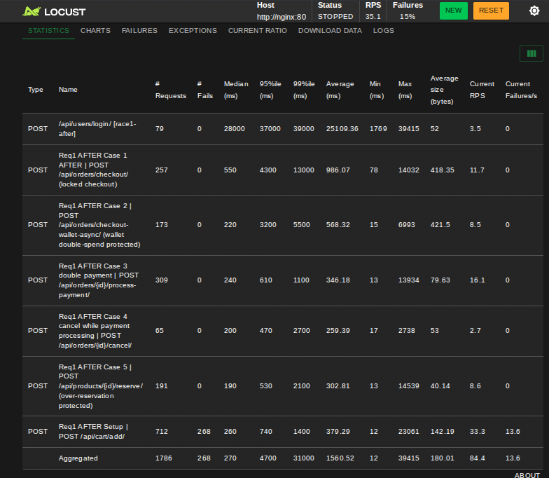

this fail (becouse the stock empty and the logic return 404 not found)


and this  from our terminal:

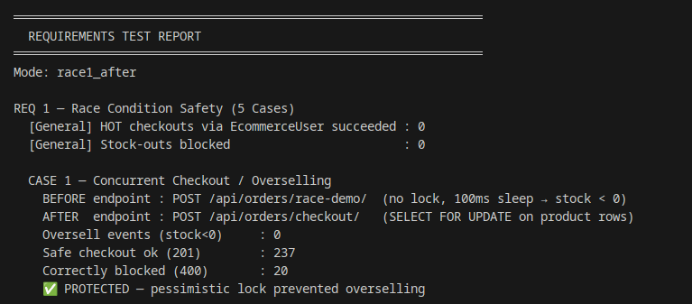

### 3.4 Case 2: Wallet Checkout / Double Spend

This occurs when multiple payment requests are sent simultaneously from the same user's wallet account.

Before a solution is found, if the wallet balance is not protected, two requests might read the same balance before the amount is debited.

Potential outcome:
The user could potentially withdraw the same balance more than once.

Example: If the balance is 100, and two requests totaling 80 are sent simultaneously, both requests might succeed without proper protection.
r
**Demo/Risk path:** `POST /api/orders/blocking-wallet-checkout(double-spend)`

This endpoint maps to the synchronous wallet checkout. It demonstrates the risk area: several concurrent wallet purchases compete for the same user balance while the payment gateway simulation takes 3 seconds. In the current code, the service already protects this path by locking the user row before checking and deducting wallet balance.


now the test in locust:
This image was taken from a test of the Wallet Checkout/Double Spend in Locust scenario, where 269 simultaneous requests were sent to the wallet payment endpoint. It shows an insufficient number of requests that failed or were rejected, which is expected in this scenario because the system prevents multiple attempts to allocate phone credit during a simultaneous push.

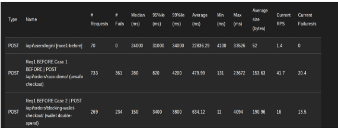


This image shows that Locust recorded 234 rejected requests for Wallet Checkout/Double Spend, due to the appearance of code 409 Conflict.
Code 409 here does not indicate a system failure, but rather that the system detected a conflict attempt during the wallet payment and blocked it securely. This means that another request was attempting to use the same wallet balance at the same time, so the request was rejected to protect the balance and prevent a double-spend issue.


This analysis is performed at the terminal after the test is complete.

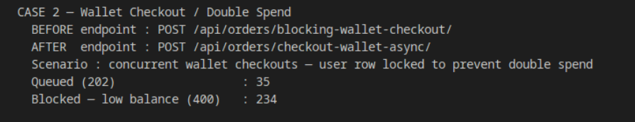


We took a screenshot of the balance for two reasons:
1. To prove that simultaneous orders put pressure on the balance (meaning that many purchases were made from the wallet):
2. 
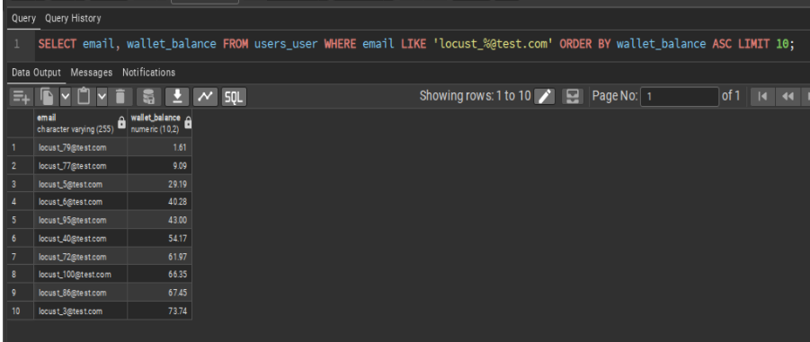


2. Proof that the system did not allow double spend (there is no negative balance, meaning the user did not spend more than their balance).
   
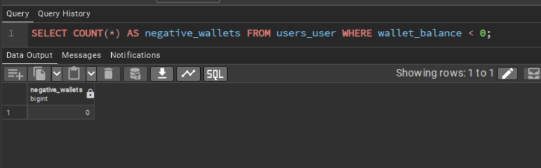


**After:** `POST /api/orders/checkout-wallet-async/`

The async endpoint returns HTTP 202 immediately and queues `process_wallet_payment_async`. The actual wallet operation calls `checkout_with_wallet()`, which locks the user row with `select_for_update()`, locks product rows, checks wallet balance under the user lock, simulates the external payment delay, deducts balance, deducts stock, and creates the completed wallet payment.


Expected safe result:

```text
Only valid wallet checkouts consume balance.
Concurrent requests cannot spend the same wallet balance twice.
Insufficient balance is rejected by the locked transaction.
```

### 3.5 Case 3: Double Payment Processing

**Before:** `POST /api/orders/<id>/process-payment-unsafe/`

The unsafe endpoint reads the order and payment without row locks. It sleeps for 100 ms, then marks the payment as completed even if another request already completed it. This simulates a duplicate charge bug.

**After:** `POST /api/orders/<id>/process-payment/`

The safe service `process_payment()` locks the `Order` row and the related `Payment` row with `select_for_update()`. It rejects cancelled orders and rejects a payment that is already `COMPLETED`.

Expected safe result:

```text
First payment request succeeds with HTTP 200.
Second payment request is rejected with HTTP 400: Payment already completed.
```

### 3.6 Case 4: Cancel Order While Payment Is Processing

**Before:** `POST /api/orders/<id>/cancel-unsafe/`

The unsafe cancellation endpoint does not lock the order row and does not enforce the order state machine. It can produce an invalid state where payment is completed but the order is later cancelled.

**After:** `POST /api/orders/<id>/cancel/`

The safe service `cancel_order()` locks the order row with `select_for_update()` and only permits cancellation while the order is `PENDING` or `CONFIRMED`. Once payment processing changes the order to `PROCESSING`, cancellation is rejected.

Expected safe result:

```text
Cancellation succeeds only for cancellable states.
Cancellation is blocked for PROCESSING, CANCELLED, or other invalid states.
```

### 3.7 Case 5: Product Reservation / Over-Reservation

**Before:** `POST /api/products/<id>/reserve-unsafe/`

The unsafe endpoint calculates active reservations without locking, sleeps for 100 ms, then creates a new `OrderLock`. Concurrent users can all see the same old reserved quantity and create reservations that exceed product stock.

**After:** `POST /api/products/<id>/reserve/`

The safe endpoint calls `create_order_lock()`, which wraps the reservation in a transaction and locks the product row with `select_for_update()`. The request only creates the reservation if enough stock is available.

Expected safe result:

```text
Valid reservations return HTTP 201.
Excess reservations return HTTP 400.
Total active reservations cannot exceed available stock through the safe endpoint.
```

### 3.8 Validation Commands

Start and seed the system:

```bash
docker compose up --build -d
docker compose run --rm app1 python manage.py seed_ecommerce --clean
```

Run before/demo race-condition tests:

```bash
docker compose run --rm \
  -e LOCUST_MODE=race1_before \
  locust -f locustfile.py --host http://nginx:80 \
  --users 50 --spawn-rate 10 --headless --run-time 1m
```

Run safe race-condition tests:

```bash
docker compose run --rm \
  -e LOCUST_MODE=race1_after \
  locust -f locustfile.py --host http://nginx:80 \
  --users 50 --spawn-rate 10 --headless --run-time 1m
```

Verify no negative stock after the safe run:

```bash
docker exec ecommerce_db psql -U ecommerce_user -d ecommerce_db \
  -c "SELECT id, name, stock FROM products_product WHERE stock < 0;"
```

Expected result:

```text
0 rows
```

---

## 4. Requirement 2 - Resource Management and Capacity Control

### 4.1 Problem

The backend must control parallel work so it does not collapse under load or become slow because of under-utilization. Concurrency exists at several layers: HTTP request handling, database connections, background workers, and retry behavior.

### 4.2 Implemented Controls

| Layer | Control |
|---|---|
| HTTP server | Gunicorn `gthread` worker class |
| Per app container | `--workers=8 --threads=3` |
| Total app capacity | `5 containers x 8 workers x 3 threads = 120 request handlers` |
| Database connection pressure | PgBouncer transaction pooling |
| PostgreSQL headroom | `max_connections=200` |
| Django connection reuse | `CONN_MAX_AGE=60` |
| Celery capacity | Queue-specific workers and fixed concurrency |
| Retry pressure | Optimistic stock retry uses short backoff |

### 4.3 Current Gunicorn Configuration

Each app container starts with:

```bash
gunicorn --worker-class=gthread --workers=8 --threads=3 \
  --access-logfile=- --error-logfile=- \
  --bind=0.0.0.0:8000 config.wsgi:application
```

Capacity calculation:

```text
Each app container: 8 workers x 3 threads = 24 request handlers
All app containers: 5 x 24 = 120 request handlers
```

### 4.4 Database Connection Control

Django and Celery connect to PgBouncer at:

```text
DB_HOST=pgbouncer
DB_PORT=5432
```

PgBouncer then connects to PostgreSQL at `db:5432`. This protects PostgreSQL from one direct connection per request thread or Celery task.

Current PgBouncer settings:

```text
POOL_MODE=transaction
MAX_CLIENT_CONN=500
DEFAULT_POOL_SIZE=30
RESERVE_POOL_SIZE=10
```

### 4.5 Celery Capacity Control

| Worker | Queue | Concurrency | Purpose |
|---|---|---:|---|
| `celery_worker` | `celery` | 2 | General tasks |
| `celery_email_worker` | `emails` | 4 | Email and notification tasks |
| `celery_batch_worker` | `batch` | 1 | Heavy database batch jobs |

The batch worker intentionally uses low concurrency because batch aggregation is database-heavy.

### 4.6 Validation Commands

Run capacity test:

Obtain token using admin credentials:
```bash
curl -X POST http://localhost/api/users/login/ \
  -H "Content-Type: application/json" \
  -d '{"email":"admin@demo.com","password":"admin123"}'
```
then:
```bash
docker compose run --rm \
  -e LOCUST_MODE=req2 \
  -e ADMIN_TOKEN="<admin-token>" \
  locust -f locustfile.py --host http://nginx:80 \
  --users 500 --spawn-rate 50 --headless --run-time 3m
```

Monitor containers:

```bash
docker stats ecommerce_app1 ecommerce_app2 ecommerce_app3 ecommerce_app4 ecommerce_app5 \
  ecommerce_pgbouncer ecommerce_db ecommerce_nginx ecommerce_redis
```
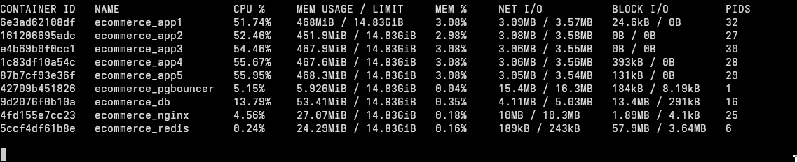


Monitor active database connections:

```bash
docker exec ecommerce_db psql -U ecommerce_user -d ecommerce_db \
  -c "SELECT count(*), state FROM pg_stat_activity WHERE datname='ecommerce_db' GROUP BY state ORDER BY state;"
```
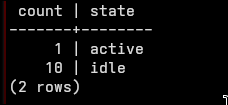
---

## 5. Requirement 3 - Asynchronous Queues

### 5.1 Problem

Some work should not block the HTTP response. Confirmation emails, cancellation emails, wallet payment simulation, expired-lock cleanup, and batch jobs are better handled outside the request path.

### 5.2 Before: Synchronous Work

The demo endpoint `POST /api/orders/checkout-sync/` creates an order and then simulates email sending with `sleep(2)` before returning HTTP 201.

The wallet sync endpoint `POST /api/orders/checkout-wallet-sync/` performs the 3-second payment gateway simulation inside the HTTP request.
checkout → create order → wait email being sent inside request → response
These are useful comparison points because the user waits for the slow work.


### 5.3 After: Celery Queues

The real checkout endpoint `POST /api/orders/checkout/` creates the order, queues `send_order_confirmation_email.delay(order.id)`, and immediately returns HTTP 201.

The wallet async endpoint `POST /api/orders/checkout-wallet-async/` queues `process_wallet_payment_async.delay(user.id)` and immediately returns HTTP 202.

Task routing is separated in `config/settings.py`:

| Task Type | Queue |
|---|---|
| Order confirmation email | `emails` |
| Order cancellation email | `emails` |
| Daily sales batch | `batch` |
| Abandoned cart cleanup | `batch` |
| Expired product locks cleanup | `celery` |
| Product cache invalidation | `celery` |

we speratead the queues based on their purpose, so we dont end up with one heavily stacked queue.

### 5.4 Validation Commands

Synchronous email comparison:


```bash
docker logs -f ecommerce_celery_email_worker:
```
the worker is empty because the emails are being sent inside the HTTP request lifetime and not offloaded tp Celery.

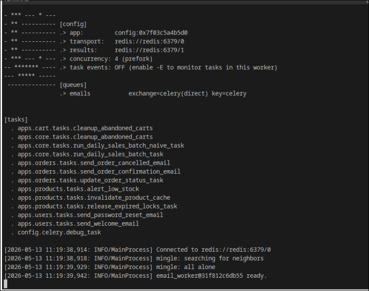


```bash
docker compose run --rm \
  -e LOCUST_MODE=req3_sync \
  locust -f locustfile.py --host http://nginx:80 \
  --users 5 --spawn-rate 1 --headless --run-time 30s
```

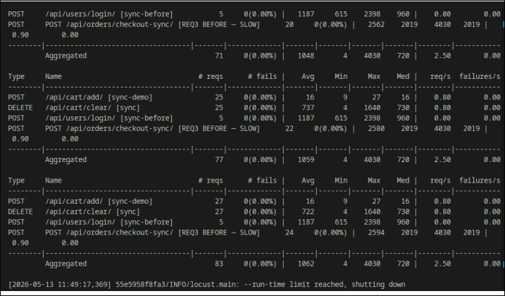

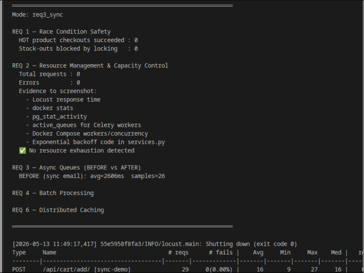


POST /api/orders/checkout-sync/ [REQ3 BEFORE — SLOW]

Avg ≈ 2100ms

Min ≈ 2017ms

Max ≈ 2300ms

Fails = 0

when watching the worker:


Async email comparison:

```bash
docker compose run --rm \
  -e LOCUST_MODE=req3_async \
  locust -f locustfile.py --host http://nginx:80 \
  --users 5 --spawn-rate 1 --headless --run-time 30s
```
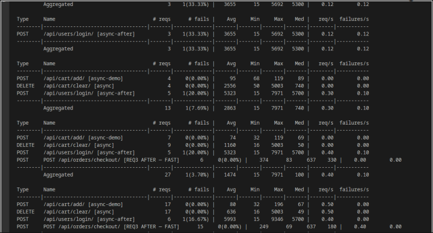

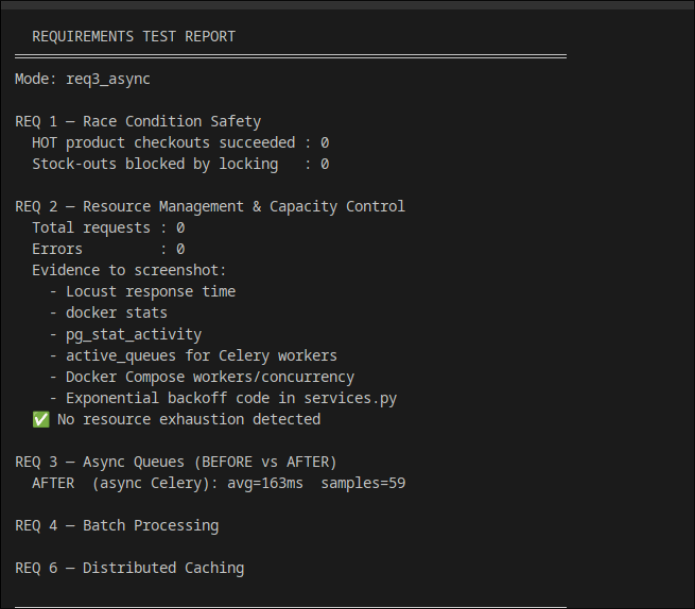


Inspect queues:

```bash
docker compose exec celery_worker celery -A config inspect active_queues
docker compose exec celery_email_worker celery -A config inspect active_queues
docker compose exec celery_batch_worker celery -A config inspect active_queues
```
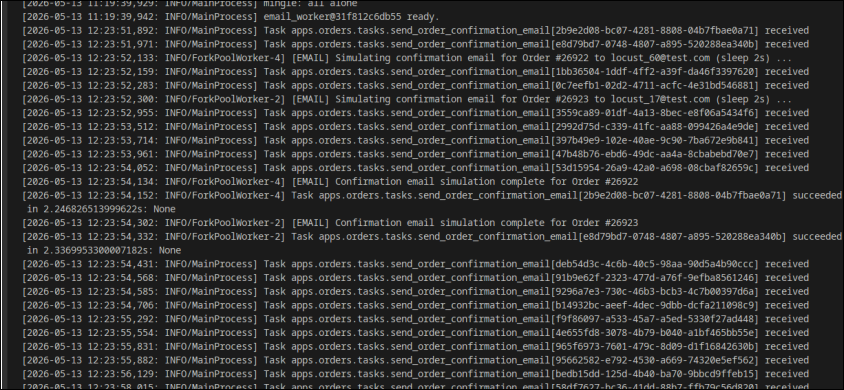
Expected result:

```text
HTTP response returns before the email/payment simulation finishes.
Celery worker logs show the background task processing later.
```
### Comparison Table
| Async queue | Sync | Measure |
|---|---|---|
| 164ms | 2594ms | Avg Response |
| 69ms | 2019ms | Min Response |
| 637ms | 4030ms | Max Response |
| works in Background | empty | Celery status |
| 16x |  | speedup |
---

## 6. Requirement 4 - Batch Processing

### 6.1 Problem

A daily sales aggregation can involve many orders. Loading all orders at once is simple but does not scale because memory usage grows with the number of orders.

### 6.2 Before: Naive Batch

The demo endpoint:

```text
POST /api/core/trigger-batch-naive/
```

queues `run_daily_sales_batch_naive_task`. This task loads all matching `Order` objects into Python memory and processes them in one pass.

Expected log evidence:

```text
[BATCH-NAIVE] Loaded ALL X order objects into memory at once -- NO CHUNKING
```


### 6.3 After: Chunked Batch

The optimized endpoint:

```text
POST /api/core/trigger-batch/
```

queues `run_daily_sales_batch_task`. The task collects matching order IDs and processes them in fixed-size chunks. The production constant is:

```text
CHUNK_SIZE = 50
```

For demonstrations, the endpoint accepts `chunk_size`, for example `{"chunk_size": 10}`, so chunks are visible even with fewer orders.

Expected log evidence:

```text
[BATCH] Chunk 1/N processed ...
[BATCH] Chunk 2/N processed ...
[BATCH] Daily sales ... COMPLETE
```


### 6.4 Scheduling and Isolation

Celery Beat schedules the daily sales report at 1:00 AM:

```text
apps.core.tasks.run_daily_sales_batch_task
```

The task is routed to the `batch` queue and consumed by `ecommerce_celery_batch_worker` with concurrency 1. This keeps heavy batch database work isolated from email notifications and normal background tasks.

### 6.5 Validation Commands

Naive batch:

```bash
docker compose run --rm \
  -e LOCUST_MODE=req4_before \
  -e ADMIN_TOKEN="<admin-token>" \
  locust -f locustfile.py --host http://nginx:80 \
  --users 1 --spawn-rate 1 --headless --run-time 30s
```

Chunked batch:

```bash
docker compose run --rm \
  -e LOCUST_MODE=req4_after \
  -e ADMIN_TOKEN="<admin-token>" \
  locust -f locustfile.py --host http://nginx:80 \
  --users 1 --spawn-rate 1 --headless --run-time 30s
```

Watch logs:

```bash
docker logs -f ecommerce_celery_batch_worker
```


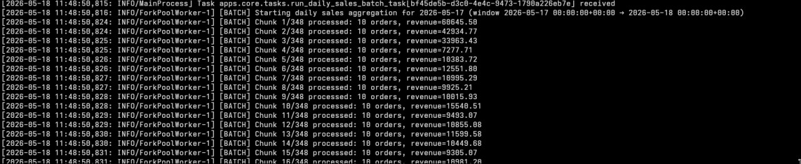

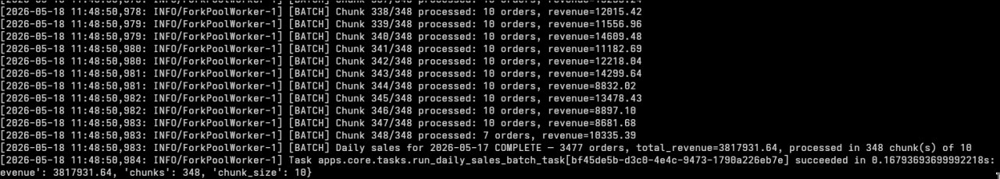


---

## 7. Requirement 5 - Load Distribution

### 7.1 Problem

A single Django/Gunicorn application instance can become a bottleneck when many users access the backend at the same time. Gunicorn has a fixed number of workers and threads, so when all handlers are busy, new requests must wait.

A single app instance also concentrates all request pressure on one application container. This creates one performance bottleneck and one point of failure for the HTTP layer.

### 7.2 Solution: Horizontal Scaling with Nginx

The project runs five identical Django/Gunicorn application containers:

```text
app1:8000
app2:8000
app3:8000
app4:8000
app5:8000
```

All external HTTP traffic first reaches Nginx. Nginx then forwards each request to one of the backend containers. All app containers share the same PostgreSQL, Redis, PgBouncer, and Celery infrastructure, so any app container can handle any API request.

This gives the backend horizontal scaling at the application layer:

```text
Client / Locust
      |
      v
Nginx reverse proxy
      |
      +--> app1:8000
      +--> app2:8000
      +--> app3:8000
      +--> app4:8000
      +--> app5:8000
      |
      v
Shared PostgreSQL, PgBouncer, Redis, and Celery workers
```

### 7.3 Load-Balancing Strategy

The active load-balancing algorithm is **Least Connections**:

```nginx
least_conn;
```

Least Connections sends each new request to the backend with the fewest active connections at that moment. This is better than simple Round Robin for this project because the workload is mixed:

- Product reads can be fast, especially when cached.
- Cart operations are usually light.
- Adding to cart can require database writes.
- Checkout is heavier because it uses transactions, stock validation, and row-level locking.

Round Robin does not know whether one backend is already busy with a slow request. Least Connections adapts to current backend activity and reduces the chance that expensive checkout requests pile up on one container while other containers are less busy.

The Nginx upstream configuration also includes basic failure handling:

```nginx
server app1:8000 max_fails=3 fail_timeout=30s;
server app2:8000 max_fails=3 fail_timeout=30s;
server app3:8000 max_fails=3 fail_timeout=30s;
server app4:8000 max_fails=3 fail_timeout=30s;
server app5:8000 max_fails=3 fail_timeout=30s;
```

This means Nginx can temporarily stop sending traffic to a backend that repeatedly fails.

### 7.4 Current Capacity

Each application container runs:

```text
8 Gunicorn workers
3 threads per worker
```

Total controlled request capacity:

```text
5 app containers x 8 Gunicorn workers x 3 threads = 120 request handlers
```

This does not mean the database can safely process 120 heavy transactional operations at the same time. Requirement 2 still controls database pressure through PgBouncer, Django connection reuse, and bounded worker counts. Requirement 5 focuses on distributing HTTP request handling across multiple app containers.

### 7.5 Why IP Hash Was Not Used

IP Hash binds the same client IP to the same backend. This is useful for sticky sessions, but this project does not require sticky sessions because token-based authentication is used and the API is stateless.

IP Hash was not selected because:

- The API does not depend on local server state.
- During Locust tests, many requests may come from the same IP or container.
- IP Hash could send too much traffic to one backend and reduce distribution quality.

### 7.6 Validation Commands

Start the full system:

```bash
docker compose up --build -d
```

Verify that Nginx and all five app containers are running:

```bash
docker ps
```

Expected containers:

```text
ecommerce_nginx
ecommerce_app1
ecommerce_app2
ecommerce_app3
ecommerce_app4
ecommerce_app5
ecommerce_db
ecommerce_redis
ecommerce_pgbouncer
```

Run a normal workload through Nginx:

```bash
docker compose run --rm \
  -e LOCUST_MODE=normal \
  -e ADMIN_TOKEN="<admin-token>" \
  locust -f locustfile.py --host http://nginx:80 \
  --users 50 --spawn-rate 10 --headless --run-time 1m
```

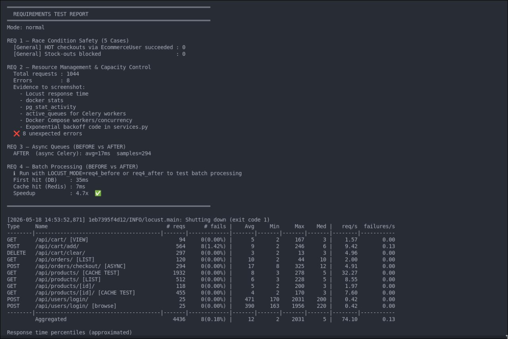
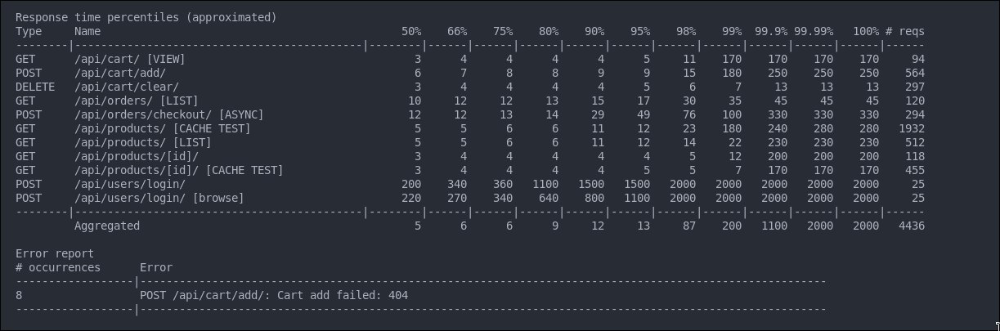

Alternatively, run Locust with the web UI:

```bash
docker compose run --rm -p 8090:8089 \
  -e LOCUST_MODE=normal \
  -e ADMIN_TOKEN="<admin-token>" \
  locust -f locustfile.py --host http://nginx:80
```

Locust UI values:

```text
Number of users: 50
Ramp up: 10
Host: http://nginx:80
```

Map app container IPs:

```bash
docker inspect -f '{{.Name}} {{range .NetworkSettings.Networks}}{{.IPAddress}}{{end}}' \
  ecommerce_app1 ecommerce_app2 ecommerce_app3 ecommerce_app4 ecommerce_app5
```
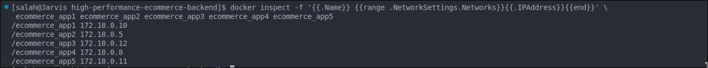
Check Nginx upstream logs:

```bash
docker logs ecommerce_nginx --tail=100
```

Expected evidence:

```text
upstream=<app1-ip>:8000
upstream=<app2-ip>:8000
upstream=<app3-ip>:8000
upstream=<app4-ip>:8000
upstream=<app5-ip>:8000
```

This expected evidence confirms that Nginx is forwarding requests to all five backend containers instead of sending all traffic to a single Django/Gunicorn instance.
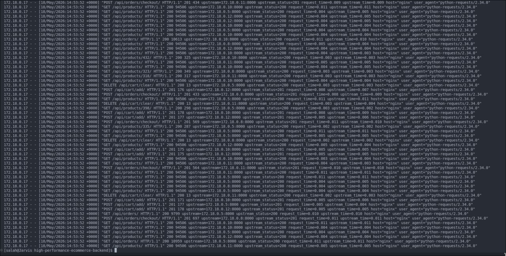
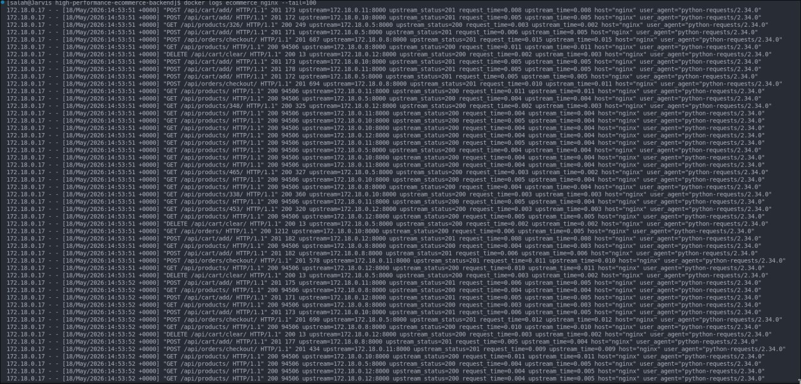


```text
docker logs -f ecommerce_app2
docker logs -f ecommerce_app3
docker logs -f ecommerce_app4
docker logs -f ecommerce_app5
```
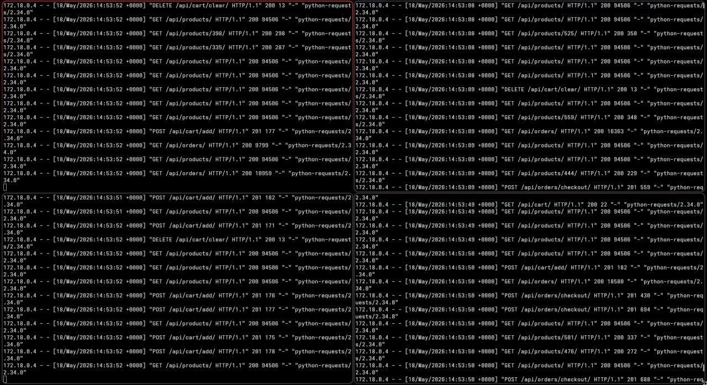


### 7.7 Result

Requirement 5 is satisfied because the system distributes requests across five Django/Gunicorn containers using Nginx with the Least Connections algorithm. The Nginx upstream logs show requests reaching all backend containers, proving horizontal traffic distribution.

---

## 8. Reproducibility Checklist

Use this sequence before capturing evidence:

```bash
docker compose up --build -d
docker compose run --rm app1 python manage.py seed_ecommerce --clean
docker ps
```

Evidence to capture:

| Requirement | Evidence |
|---|---|
| Req 1 | `race1_before` and `race1_after` Locust output for all five cases |
| Req 1 | `SELECT ... WHERE stock < 0` after safe run returns 0 rows |
| Req 2 | Locust req2 response metrics, `docker stats`, `pg_stat_activity` |
| Req 3 | Sync vs async Locust response time and Celery email logs |
| Req 4 | Naive batch log vs chunked batch log |
| Req 5 | Nginx upstream logs showing `app1`, `app2`, `app3`, `app4`, and `app5` |

---

## 9. Limitations

This is a Docker Compose demonstration environment, not a full high-availability production deployment.

Current limitations:

- Nginx is a single reverse proxy service.
- PostgreSQL is a single database service.
- Redis is a single service.
- PgBouncer is a single pooling service.
- The number of application containers is currently five: `app1`, `app2`, `app3`, `app4`, and `app5`.
- Test results depend on the local machine resources.

These limitations do not invalidate the first five requirements because the goal is to demonstrate synchronization, controlled capacity, asynchronous queues, chunked processing, and load distribution.

---

## 10. Final Conclusion

The backend satisfies Requirements 1-5 using the current project implementation.

Requirement 1 is covered through five concrete concurrency cases: overselling, wallet double spend, duplicate payment processing, invalid cancellation during payment, and over-reservation. Requirement 2 is covered through bounded Gunicorn concurrency, PgBouncer pooling, Django connection reuse, and fixed Celery worker concurrency. Requirement 3 is covered by moving slow email and wallet-payment work into Celery queues. Requirement 4 is covered by changing daily sales aggregation from a naive all-at-once job to a chunked batch task. Requirement 5 is covered by Nginx Least Connections load balancing across five Django/Gunicorn application containers.
